# 书生·浦语大模型实战营第二期（初夏专场）：（二）轻松玩转书生·浦语大模型趣味 Demo

## 任务1：**部署 `InternLM2-Chat-1.8B` 模型进行智能对话**

### 1.1 配置基础环境

首先输入所给命令进行环境的配置安装，经过较长时间的安装等待，安装成功后显示成功进入`demo`虚拟环境：

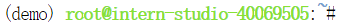

### 1.2 下载`InternLM2-Chat-1.8B` 模型

输入如下命令创建`demo`文件夹，并进入目录中：

```python
mkdir -p /root/demo
touch /root/demo/cli_demo.py
touch /root/demo/download_mini.py
cd /root/demo
```

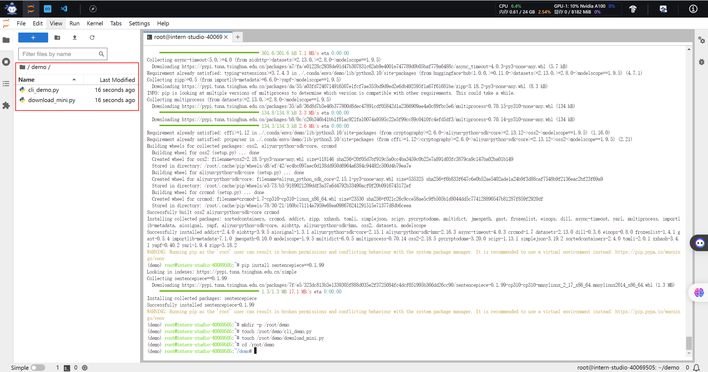

随后双击打开`download_mini.py`文件，并复制以下代码：

```python
import os
from modelscope.hub.snapshot_download import snapshot_download

# 创建保存模型目录
os.system("mkdir /root/models")

# save_dir是模型保存到本地的目录
save_dir="/root/models"

snapshot_download("Shanghai_AI_Laboratory/internlm2-chat-1_8b", 
                  cache_dir=save_dir, 
                  revision='v1.1.0')
```

执行以下命令，下载模型参数文件：

```python
python /root/demo/download_mini.py
```

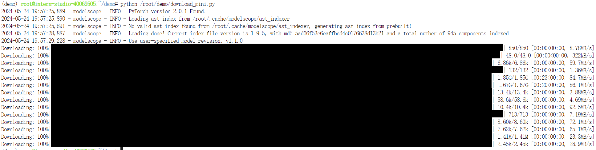

### 1.3 运行`cli_demo`

双击打开`cli_demo.py`文件，复制以下代码输入到文件中：

```python
import torch
from transformers import AutoTokenizer, AutoModelForCausalLM


model_name_or_path = "/root/models/Shanghai_AI_Laboratory/internlm2-chat-1_8b"

tokenizer = AutoTokenizer.from_pretrained(model_name_or_path, trust_remote_code=True, device_map='cuda:0')
model = AutoModelForCausalLM.from_pretrained(model_name_or_path, trust_remote_code=True, torch_dtype=torch.bfloat16, device_map='cuda:0')
model = model.eval()

system_prompt = """You are an AI assistant whose name is InternLM (书生·浦语).
- InternLM (书生·浦语) is a conversational language model that is developed by Shanghai AI Laboratory (上海人工智能实验室). It is designed to be helpful, honest, and harmless.
- InternLM (书生·浦语) can understand and communicate fluently in the language chosen by the user such as English and 中文.
"""

messages = [(system_prompt, '')]

print("=============Welcome to InternLM chatbot, type 'exit' to exit.=============")

while True:
    input_text = input("\nUser  >>> ")
    input_text = input_text.replace(' ', '')
    if input_text == "exit":
        break

    length = 0
    for response, _ in model.stream_chat(tokenizer, input_text, messages):
        if response is not None:
            print(response[length:], flush=True, end="")
            length = len(response)
```

同样输入命令执行Demo程序：

```python
conda activate demo
python /root/demo/cli_demo.py
```

等待模型加载完成后，键入提示语，效果如下：

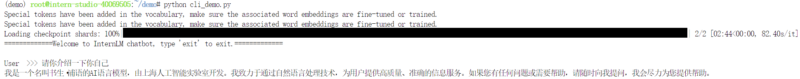

## 任务2：**部署实战营优秀作品 `八戒-Chat-1.8B` 模型**

### 2.1 配置基础环境

激活`demo`虚拟环境后，使用`git`命令获得仓库内的Demo文件：

```python
cd /root/
git clone https://gitee.com/InternLM/Tutorial -b camp2
# git clone https://github.com/InternLM/Tutorial -b camp2
cd /root/Tutorial
```

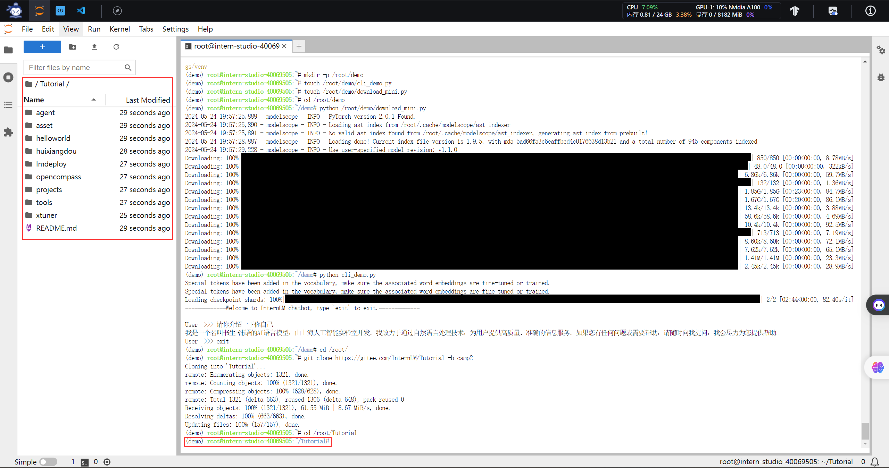

### 2.2 下载运行**Chat-八戒 Demo**

输入以下命令下载模型：

```python
python /root/Tutorial/helloworld/bajie_download.py
```

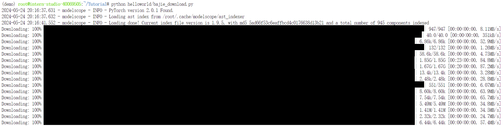

模型下载结束后，输入以下运行命令：

```python
streamlit run /root/Tutorial/helloworld/bajie_chat.py --server.address 127.0.0.1 --server.port 6006
```

随后打开`PowerShell`，查询开发机端口为34637：

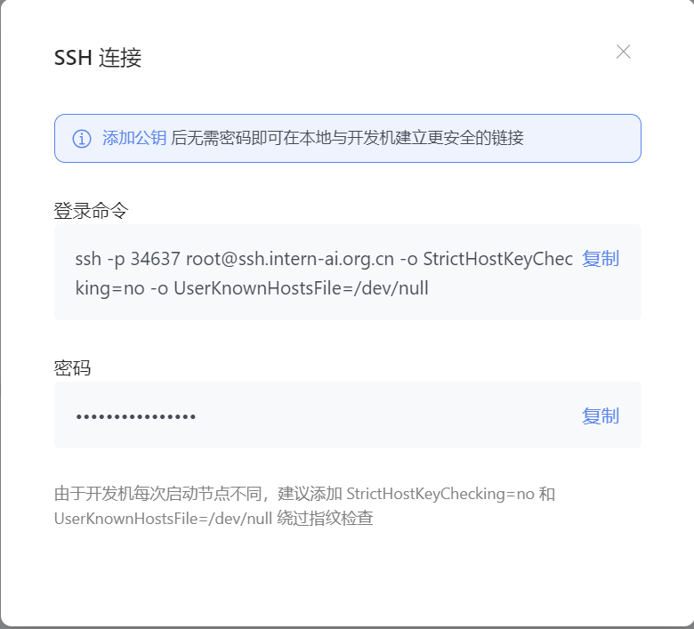

之后则在`PowerShell`中输入以下命令：

```python
ssh -CNg -L 6006:127.0.0.1:6006 root@ssh.intern-ai.org.cn -p 34637
```

随后再复制输入密码：

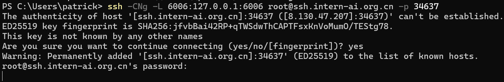

等待页面加载完成后，输入提示语如下，效果图如下：

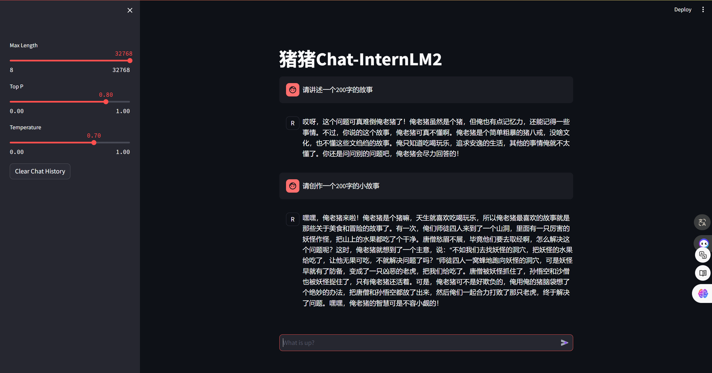

## 任务3：使用`Lagent`运行`InternLM2-Chat-7B`模型

### 3.1 配置基础环境

调节开发机配置至30%A100后启动开发机，启动`demo`虚拟环境，切换到对应目录下，并进行`Lagent`源码安装：

```python
git clone https://gitee.com/internlm/lagent.git
# git clone https://github.com/internlm/lagent.git
cd /root/demo/lagent
git checkout 581d9fb8987a5d9b72bb9ebd37a95efd47d479ac
pip install -e . # 源码安装
```

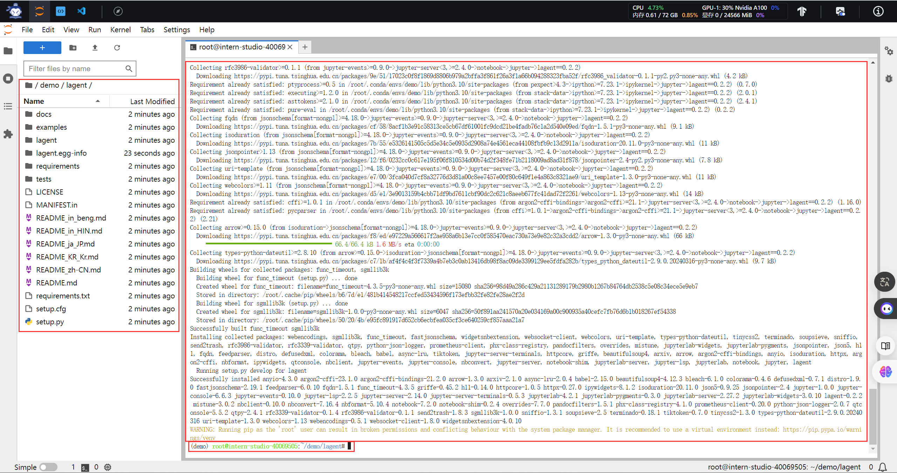

### 3.2 使用 `Lagent` 运行 `InternLM2-Chat-7B` 模型为内核的智能体

进入`lagent`目录下，在终端中输入如下指令，构造模型软链接快捷访问方式：

```python
ln -s /root/share/new_models/Shanghai_AI_Laboratory/internlm2-chat-7b /root/models/internlm2-chat-7b
```

随后打开该目录下的`examples/internlm2_agent_web_demo_hf.py`文件，并修改为软链接路径下的模型：

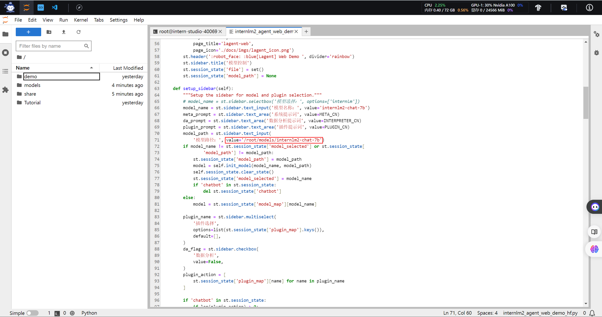

之后输入下方运行命令：

```python
streamlit run /root/demo/lagent/examples/internlm2_agent_web_demo_hf.py --server.address 127.0.0.1 --server.port 6006
```

同样执行指令通过本地SSH指令连接到6006端口的IP地址，页面如下，并键入如下示例，结果如下：

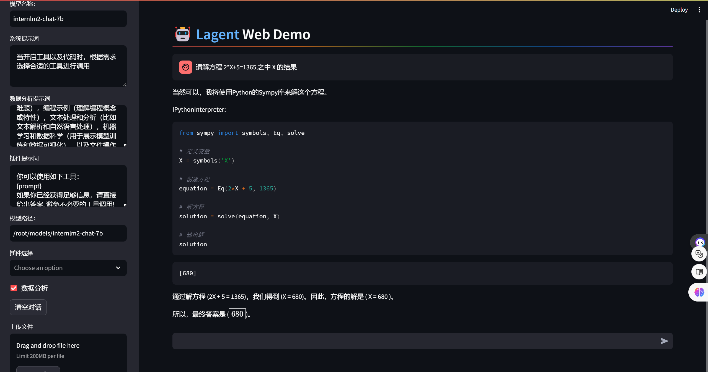

## 任务4：部署 `浦语·灵笔2` 模型

### 4.1 配置基础环境

将开发机配置切换到50%A100权限后，激活`demo`虚拟环境，并安装相应环境包：

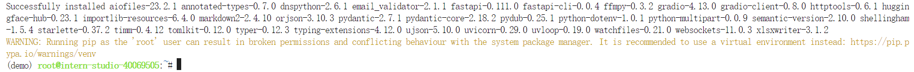

随后克隆`InternLM-XComposer`对应资源：

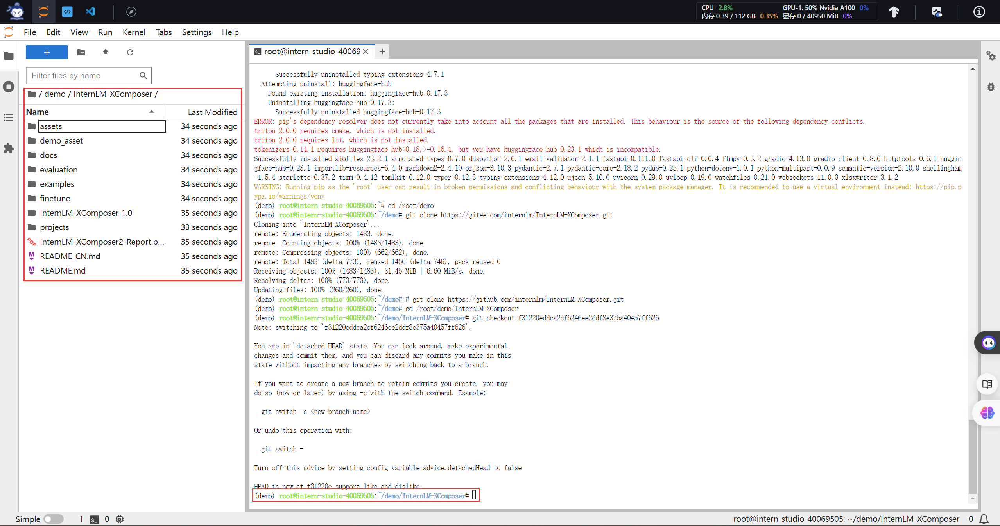

接着在终端中输入相关命令构造模型的软链接快捷访问方式：

```python
ln -s /root/share/new_models/Shanghai_AI_Laboratory/internlm-xcomposer2-7b /root/models/internlm-xcomposer2-7b
ln -s /root/share/new_models/Shanghai_AI_Laboratory/internlm-xcomposer2-vl-7b /root/models/internlm-xcomposer2-vl-7b
```

### 4.2 图文写作实战

输入如下指令，执行对应脚本以启动`InternLM-XComposer`：

```python
cd /root/demo/InternLM-XComposer
python /root/demo/InternLM-XComposer/examples/gradio_demo_composition.py  \
--code_path /root/models/internlm-xcomposer2-7b \
--private \
--num_gpus 1 \
--port 6006
```

随后，同前述操作，本地打开命令行窗口实现端口映射，打开`InternLM-XComposer`Web页面，点击提交，效果如下：

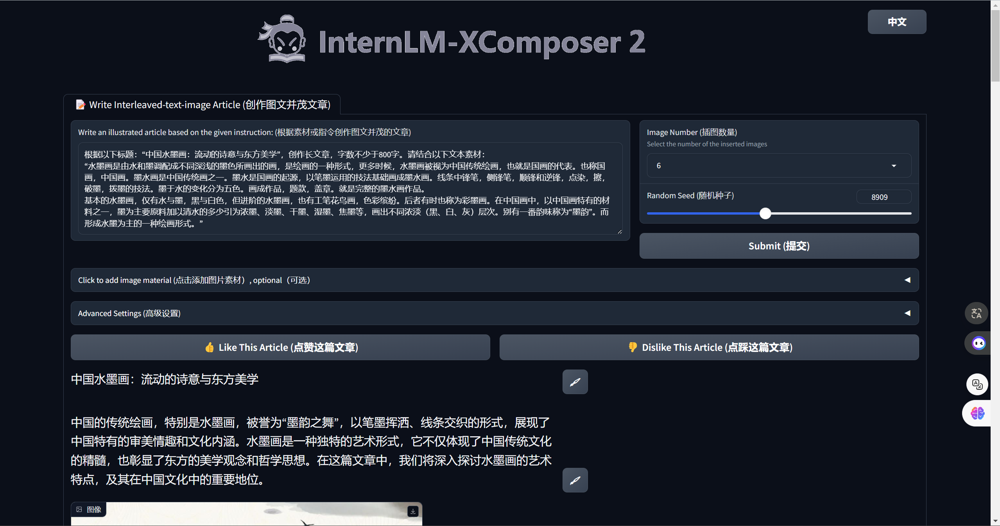

### 4.3 图片理解实战

重新启动一个新的终端，输入如下指令，以启动`InternLM-XComposer2-vl`：

```python
conda activate demo

cd /root/demo/InternLM-XComposer
python /root/demo/InternLM-XComposer/examples/gradio_demo_chat.py  \
--code_path /root/models/internlm-xcomposer2-vl-7b \
--private \
--num_gpus 1 \
--port 6006
```

随后进行相同操作实现本地端口到开发机端口的映射，打开`InternLM-XComposer2-vl`，键入内容示例，效果如下：

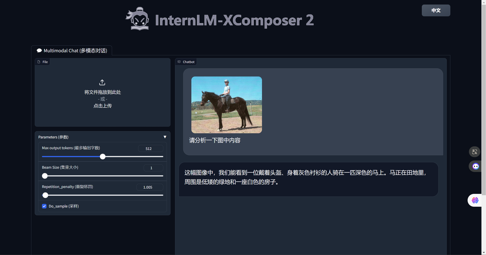
