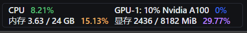
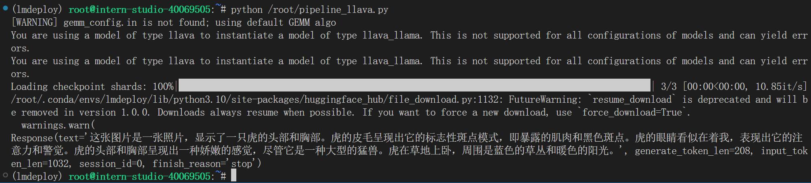
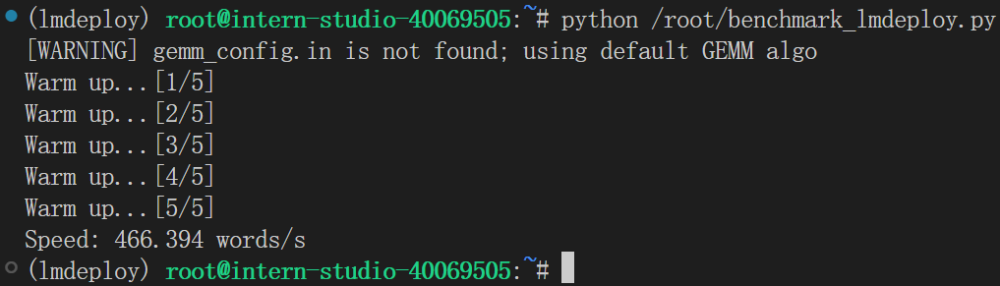

# 书生·浦语大模型实战营第二期（初夏专场）：（五）LMDeploy 量化部署 LLM-VLM 实践

## 1 配置基础环境

输入如下命令进行`lmdeploy`虚拟环境的安装：

```python
studio-conda -t lmdeploy -o pytorch-2.1.2
```

安装成功后效果图如下所示：


而后，激活该虚拟环境，并安装0.3.0版本的`lmdeploy`，安装成功后结果图如下所示：


## 2 LMDeploy模型对话(chat)

### 2.1 下载模型

输入如下命令查看开发机已经准备好的预训练模型：

```python
ls /root/share/new_models/Shanghai_AI_Laboratory/
```

输出结果如下所示：


执行如下命令实现将开发机共享的预训练模型软链接到服务器本地目录中：

```python
ln -s /root/share/new_models/Shanghai_AI_Laboratory/internlm2-chat-1_8b /root/
# cp -r /root/share/new_models/Shanghai_AI_Laboratory/internlm2-chat-1_8b /root/
```

随后输入`ls`命令，以查看根目录下的文件列表，结果如下所示：


可以看到目录下多了一个名为`internlm2-chat-1_8b`的文件夹，说明下载好的预训练模型已软链接成功

### 2.2 使用Transformer库运行模型

在开发机里打开`VSCode`，并打开其终端，输入如下指令，以新建`pipeline_transformer.py`：

```python
touch /root/pipeline_transformer.py
```

点击该文件打开，输入如下代码作为其内容：

```python
import torch
from transformers import AutoTokenizer, AutoModelForCausalLM

tokenizer = AutoTokenizer.from_pretrained("/root/internlm2-chat-1_8b", trust_remote_code=True)

# Set `torch_dtype=torch.float16` to load model in float16, otherwise it will be loaded as float32 and cause OOM Error.
model = AutoModelForCausalLM.from_pretrained("/root/internlm2-chat-1_8b", torch_dtype=torch.float16, trust_remote_code=True).cuda()
model = model.eval()

inp = "hello"
print("[INPUT]", inp)
response, history = model.chat(tokenizer, inp, history=[])
print("[OUTPUT]", response)

inp = "please provide three suggestions about time management"
print("[INPUT]", inp)
response, history = model.chat(tokenizer, inp, history=history)
print("[OUTPUT]", response)
```

完成效果如下所示：


保存该文件后，激活`lmdeploy`虚拟环境，并运行该文件：

```python
python /root/pipeline_transformer.py
```

输出结果如下所示，运行时间，即推理速度明显偏慢：


### 2.3 使用LMDeploy与模型对话

首先激活创建好的`lmdeploy`虚拟环境，并输入以下命令运行下载好的1.8B模型：

```python
lmdeploy chat /root/internlm2-chat-1_8b
```

待模型加载完成后，键入内容示例如下：


推理明显相比于`Transformer`明显变快

## 3 LMDeploy模型量化(lite)

### 3.1 设置最大KV Cache缓存大小

`LMDeploy`的`KV Cache`管理器可以通过设置`--cache-max-entry-count`参数，以控制KV缓存占用剩余显存的最大比例，默认比例为0.8

首先，输入以下命令保持不加该参数测试显存占用情况：

```python
lmdeploy chat /root/internlm2-chat-1_8b
```


可以看到，此时显存占用为7816MB

接着，将`--cache-max-entry-count`参数设为0.5，查看显存占用情况：

```python
lmdeploy chat /root/internlm2-chat-1_8b --cache-max-entry-count 0.5
```


可以看到，显存占用明显下降，变为6600MB

最后，将此参数设为极限值进行尝试，将其设置为0.01，即为约等于禁止`KV Cache`占用显存：

```python
lmdeploy chat /root/internlm2-chat-1_8b --cache-max-entry-count 0.01
```


可以看到，这时的显存占用仅为4552MB，但是其代价为会降低模型推理速度

### 3.2 使用W4A16量化

首先输入以下命令安装相关依赖库：

```python
pip install einops==0.7.0
```


接着输入以下命令以完成模型量化工作：

```python
lmdeploy lite auto_awq \
   /root/internlm2-chat-1_8b \
  --calib-dataset 'ptb' \
  --calib-samples 128 \
  --calib-seqlen 1024 \
  --w-bits 4 \
  --w-group-size 128 \
  --work-dir /root/internlm2-chat-1_8b-4bit
```

耐心等待模型量化工作结束后，输出结果图如下所示：


接着再输入如下命令运行经过W4A16量化后的模型，并将`KV Cache`比例再次调为0.01，以查看显存占用情况：

```python
lmdeploy chat /root/internlm2-chat-1_8b-4bit --model-format awq --cache-max-entry-count 0.01
```



可以看到，显存占用相比没有经过量化前，下降到了2436MB，明显降低

## 4 LMDeploy服务(serve)

### 4.1 启动API服务器

输入以下命令启动API服务器，以推理`internlm2-chat-1_8b`模型：

```python
lmdeploy serve api_server \
    /root/internlm2-chat-1_8b \
    --model-format hf \
    --quant-policy 0 \
    --server-name 0.0.0.0 \
    --server-port 23333 \
    --tp 1
```

运行结果如下所示：


随后在本地打开`cmd`窗口以进行`SSH`转发，再打开浏览器，访问`http://127.0.0.1:23333`，运行效果如下所示：


### 4.2 命令行客户端连接API服务器

首先通过`VS Code`新建一个终端，激活虚拟环境后，运行如下指令以启动命令行客户端：

```python
lmdeploy serve api_client http://localhost:23333
```

待启动完成后，直接在命令行窗口中与模型对话，效果图如下所示：


### 4.3 网页客户端连接API服务器

首先关闭刚刚启动的`VS Code`前端，再新建一个`VS Code`终端，并激活虚拟环境，随后使用`Gradio`作为前端，输入以下指令以启动网页客户端：

```python
lmdeploy serve gradio http://localhost:23333 \
    --server-name 0.0.0.0 \
    --server-port 6006
```

运行后效果图如下所示：


随后在本地新建`cmd`窗口以进行`SSH`转发，并再打开浏览器，访问`http://127.0.0.1:6006`，键入内容示例如下，运行效果图如下所示：


## 5 Python代码集成

### 5.1 Python代码集成运行1.8B模型

首先激活虚拟环境，并新建`pipeline.py`文件，随后打开该文件，复制以下内容到该文件中：

```python
from lmdeploy import pipeline

pipe = pipeline('/root/internlm2-chat-1_8b')
response = pipe(['Hi, pls intro yourself', '上海是'])
print(response)
```

保存后再运行该文件，输出结果如下所示：


### 5.2 向TurboMind后端传递参数

首先新建`pipeline_kv.py`文件，再打开该文件，并复制以下内容到该文件中：

```python
from lmdeploy import pipeline, TurbomindEngineConfig

# 调低 k/v cache内存占比调整为总显存的 20%
backend_config = TurbomindEngineConfig(cache_max_entry_count=0.2)

pipe = pipeline('/root/internlm2-chat-1_8b',
                backend_config=backend_config)
response = pipe(['Hi, pls intro yourself', '上海是'])
print(response)
```

保存后再运行该文件，输出结果如下所示：


## 6 拓展部分

### 6.1 使用LMDeploy运行视觉多模态大模型llava

首先激活虚拟环境，安装`llava`所需依赖库后，新建`pipeline_llava.py`文件，随后打开该文件，并复制以下内容到该文件中：

```python
from lmdeploy.vl import load_image
from lmdeploy import pipeline, TurbomindEngineConfig


backend_config = TurbomindEngineConfig(session_len=8192) # 图片分辨率较高时请调高session_len
# pipe = pipeline('liuhaotian/llava-v1.6-vicuna-7b', backend_config=backend_config) 非开发机运行此命令
pipe = pipeline('/share/new_models/liuhaotian/llava-v1.6-vicuna-7b', backend_config=backend_config)

image = load_image('https://raw.githubusercontent.com/open-mmlab/mmdeploy/main/tests/data/tiger.jpeg')
response = pipe(('describe this image', image))
print(response)
```

保存后再运行该文件，输出结果如下所示：


将上述文件中第10行的内容中的提示词改为中文形式的“请描述一下这张图片”，随后再运行该文件，输出结果如下所示：



新建`gradio_llava.py`以通过`Gradio`来运行`llava`模型，随后打开该文件，并复制以下内容到该文件中：

```python
import gradio as gr
from lmdeploy import pipeline, TurbomindEngineConfig


backend_config = TurbomindEngineConfig(session_len=8192) # 图片分辨率较高时请调高session_len
# pipe = pipeline('liuhaotian/llava-v1.6-vicuna-7b', backend_config=backend_config) 非开发机运行此命令
pipe = pipeline('/share/new_models/liuhaotian/llava-v1.6-vicuna-7b', backend_config=backend_config)

def model(image, text):
    if image is None:
        return [(text, "请上传一张图片。")]
    else:
        response = pipe((text, image)).text
        return [(text, response)]

demo = gr.Interface(fn=model, inputs=[gr.Image(type="pil"), gr.Textbox()], outputs=gr.Chatbot())
demo.launch()
```

保存后再运行该文件，随后在本地新建一个`cmd`窗口，以进行`SSH`转发，通过浏览器访问`http://127.0.0.1:7860`，待页面加载完成后，键入内容示例如下，输出结果如下所示：


### 6.2 定量比较LMDeploy与Transformer库的推理速度差异

新建名为`benchmark_transformer.py`文件，随后打开该文件，并复制以下内容到该文件中：

```python
import torch
import datetime
from transformers import AutoTokenizer, AutoModelForCausalLM

tokenizer = AutoTokenizer.from_pretrained("/root/internlm2-chat-1_8b", trust_remote_code=True)

# Set `torch_dtype=torch.float16` to load model in float16, otherwise it will be loaded as float32 and cause OOM Error.
model = AutoModelForCausalLM.from_pretrained("/root/internlm2-chat-1_8b", torch_dtype=torch.float16, trust_remote_code=True).cuda()
model = model.eval()

# warmup
inp = "hello"
for i in range(5):
    print("Warm up...[{}/5]".format(i+1))
    response, history = model.chat(tokenizer, inp, history=[])

# test speed
inp = "请介绍一下你自己。"
times = 10
total_words = 0
start_time = datetime.datetime.now()
for i in range(times):
    response, history = model.chat(tokenizer, inp, history=history)
    total_words += len(response)
end_time = datetime.datetime.now()

delta_time = end_time - start_time
delta_time = delta_time.seconds + delta_time.microseconds / 1000000.0
speed = total_words / delta_time
print("Speed: {:.3f} words/s".format(speed))
```

保存后再运行该文件，运行结果如下所示，可以看到，`Transformer`库的推理速度约为54.456 words/s


随后新建名为`benchmark_lmdeploy.py`文件，并打开该文件，并复制以下内容到该文件中：

```python
import datetime
from lmdeploy import pipeline

pipe = pipeline('/root/internlm2-chat-1_8b')

# warmup
inp = "hello"
for i in range(5):
    print("Warm up...[{}/5]".format(i+1))
    response = pipe([inp])

# test speed
inp = "请介绍一下你自己。"
times = 10
total_words = 0
start_time = datetime.datetime.now()
for i in range(times):
    response = pipe([inp])
    total_words += len(response[0].text)
end_time = datetime.datetime.now()

delta_time = end_time - start_time
delta_time = delta_time.seconds + delta_time.microseconds / 1000000.0
speed = total_words / delta_time
print("Speed: {:.3f} words/s".format(speed))
```

保存后再运行该文件，运行结果如下所示，可以看到，`LMDeploy`库的推理速度约为466.394 words/s，是`Transformer`库的8倍

