# 书生·浦语大模型实战营第二期（初夏专场）：（六）Lagent & AgentLego 智能体应用搭建

## 1 环境配置

### 1.1 创建开发机和conda环境

首先创建好开发机后执行如下命令以创建用于存放`Agent`相关文件的目录：

```python
mkdir -p /root/agent
```

随后输入以下指令以配置相应的`Agent`虚拟环境：

```python
studio-conda -t agent -o pytorch-2.1.2
```

安装成功后效果图如下所示：

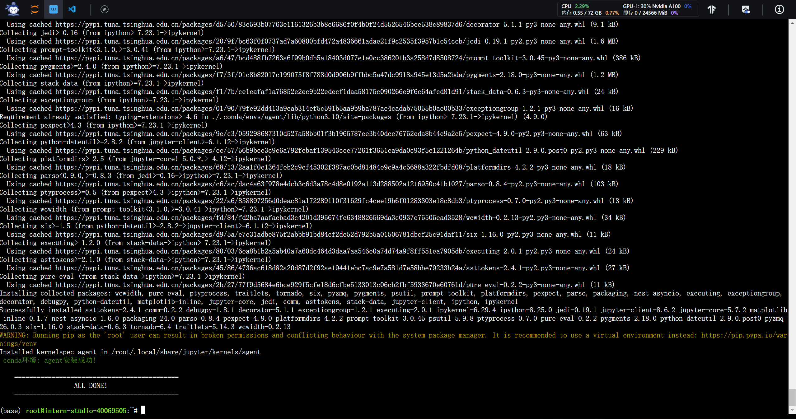

### 1.2 安装Lagent和AgentLego

输入以下命令以直接从源码安装`Lagent`和`AgentLego`：

```python
cd /root/agent
conda activate agent
git clone https://gitee.com/internlm/lagent.git
cd lagent && git checkout 581d9fb && pip install -e . && cd ..
git clone https://gitee.com/internlm/agentlego.git
cd agentlego && git checkout 7769e0d && pip install -e . && cd ..
```

安装成功后效果图如下所示：

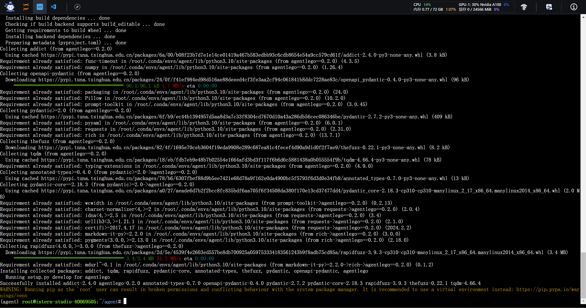

### 1.3 安装其他依赖

输入以下命令以安装其他所需依赖库：

```python
conda activate agent
pip install lmdeploy==0.3.0
```

安装成功后效果图如下所示：

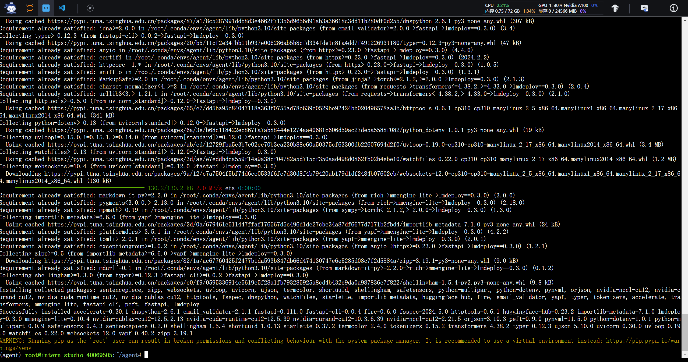

### 1.4 准备Tutorial

输入以下命令以克隆`Tutorial`代码库：

```python
cd /root/agent
git clone -b camp2 https://gitee.com/internlm/Tutorial.git
```

安装成功后效果图如下所示：

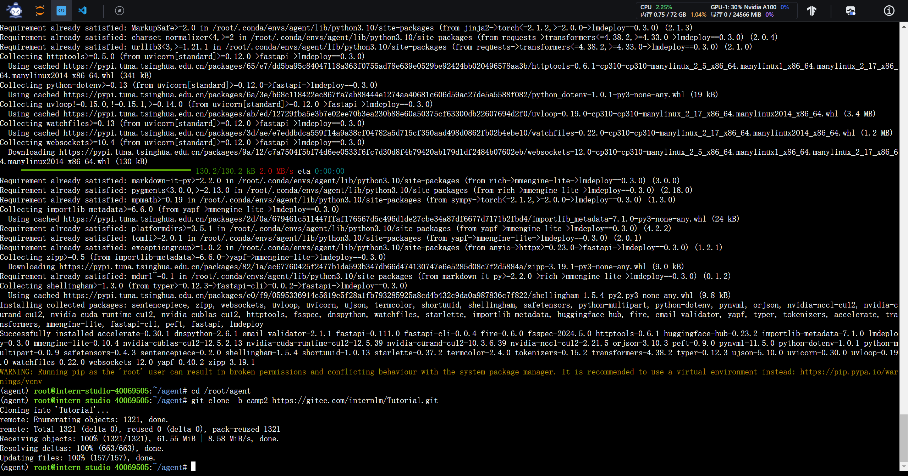

## 2 Lagent：轻量级智能体框架

### 2.1 Lagent Web Demo

#### 2.1.1 使用 LMDeploy 部署

输入以下命令以使用`LMDeploy`启动一个`api_server`：

```python
conda activate agent
lmdeploy serve api_server /root/share/new_models/Shanghai_AI_Laboratory/internlm2-chat-7b \
                            --server-name 127.0.0.1 \
                            --model-name internlm2-chat-7b \
                            --cache-max-entry-count 0.1
```

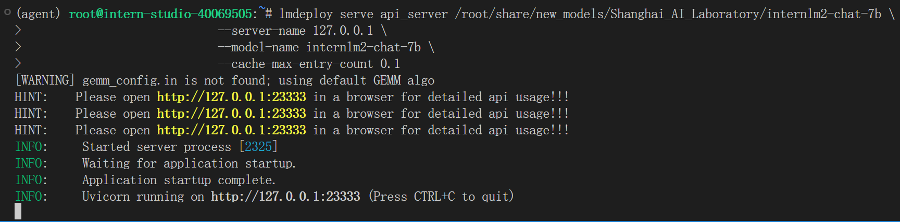

#### 2.1.2 启动并使用Lagent Web Demo

新建一个终端，并输入以下命令以启动`Lagent Web Demo`：

```python
conda activate agent
cd /root/agent/lagent/examples
streamlit run internlm2_agent_web_demo.py --server.address 127.0.0.1 --server.port 7860
```

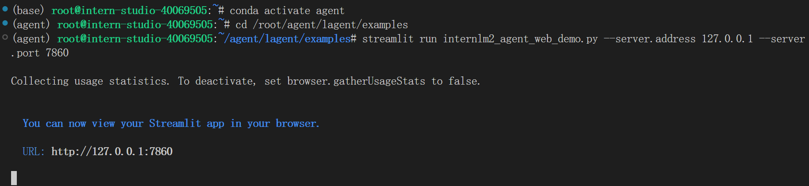

随后，在本地打开`cmd`窗口，以进行`SSH`转发，接着在浏览器中打开[http://localhost:7860](http://localhost:7860/)以使用`Lagent Web Demo`。首先输入模型 IP 为 127.0.0.1:23333，在输入完成后按下回车键以确认。并选择插件为 ArxivSearch，以让模型获得在 arxiv 上搜索论文的能力，随后再键入示例内容如下，模型生成效果图如下所示：

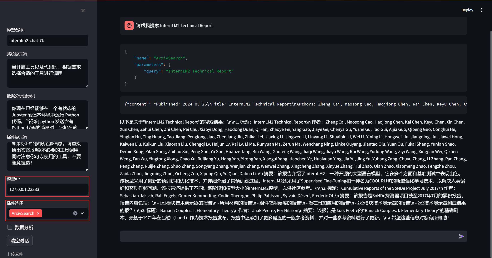

### 2.2 用 Lagent 自定义工具

#### 2.2.1 创建工具文件

首先新建一个`/root/agent/lagent/lagent/actions/weather.py`文件，并将下述内容复制进该文件中：

```python
import json
import os
import requests
from typing import Optional, Type

from lagent.actions.base_action import BaseAction, tool_api
from lagent.actions.parser import BaseParser, JsonParser
from lagent.schema import ActionReturn, ActionStatusCode

class WeatherQuery(BaseAction):
    """Weather plugin for querying weather information."""
    
    def __init__(self,
                 key: Optional[str] = None,
                 description: Optional[dict] = None,
                 parser: Type[BaseParser] = JsonParser,
                 enable: bool = True) -> None:
        super().__init__(description, parser, enable)
        key = os.environ.get('WEATHER_API_KEY', key)
        if key is None:
            raise ValueError(
                'Please set Weather API key either in the environment '
                'as WEATHER_API_KEY or pass it as `key`')
        self.key = key
        self.location_query_url = 'https://geoapi.qweather.com/v2/city/lookup'
        self.weather_query_url = 'https://devapi.qweather.com/v7/weather/now'

    @tool_api
    def run(self, query: str) -> ActionReturn:
        """一个天气查询API。可以根据城市名查询天气信息。
        
        Args:
            query (:class:`str`): The city name to query.
        """
        tool_return = ActionReturn(type=self.name)
        status_code, response = self._search(query)
        if status_code == -1:
            tool_return.errmsg = response
            tool_return.state = ActionStatusCode.HTTP_ERROR
        elif status_code == 200:
            parsed_res = self._parse_results(response)
            tool_return.result = [dict(type='text', content=str(parsed_res))]
            tool_return.state = ActionStatusCode.SUCCESS
        else:
            tool_return.errmsg = str(status_code)
            tool_return.state = ActionStatusCode.API_ERROR
        return tool_return
    
    def _parse_results(self, results: dict) -> str:
        """Parse the weather results from QWeather API.
        
        Args:
            results (dict): The weather content from QWeather API
                in json format.
        
        Returns:
            str: The parsed weather results.
        """
        now = results['now']
        data = [
            f'数据观测时间: {now["obsTime"]}',
            f'温度: {now["temp"]}°C',
            f'体感温度: {now["feelsLike"]}°C',
            f'天气: {now["text"]}',
            f'风向: {now["windDir"]}，角度为 {now["wind360"]}°',
            f'风力等级: {now["windScale"]}，风速为 {now["windSpeed"]} km/h',
            f'相对湿度: {now["humidity"]}',
            f'当前小时累计降水量: {now["precip"]} mm',
            f'大气压强: {now["pressure"]} 百帕',
            f'能见度: {now["vis"]} km',
        ]
        return '\n'.join(data)

    def _search(self, query: str):
        # get city_code
        try:
            city_code_response = requests.get(
                self.location_query_url,
                params={'key': self.key, 'location': query}
            )
        except Exception as e:
            return -1, str(e)
        if city_code_response.status_code != 200:
            return city_code_response.status_code, city_code_response.json()
        city_code_response = city_code_response.json()
        if len(city_code_response['location']) == 0:
            return -1, '未查询到城市'
        city_code = city_code_response['location'][0]['id']
        # get weather
        try:
            weather_response = requests.get(
                self.weather_query_url,
                params={'key': self.key, 'location': city_code}
            )
        except Exception as e:
            return -1, str(e)
        return weather_response.status_code, weather_response.json()
```

#### 2.2.2 获取API KEY

通过https://dev.qweather.com/docs/api/新建一个项目获取KEY，并先复制好：

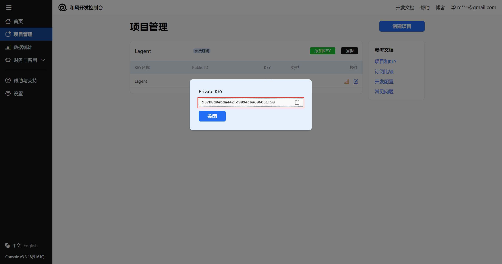

#### 2.2.3 体验自定义工具效果

首先，先关闭之前打开的两个终端，随后输入以下命令分别启动`LMDeploy`服务以及`Tutorial`里的`Web Demo`：

```python
conda activate agent
lmdeploy serve api_server /root/share/new_models/Shanghai_AI_Laboratory/internlm2-chat-7b \
                            --server-name 127.0.0.1 \
                            --model-name internlm2-chat-7b \
                            --cache-max-entry-count 0.1
```

```python
export WEATHER_API_KEY=在2.2.2节获取的API KEY
# 比如 export WEATHER_API_KEY=1234567890abcdef
conda activate agent
cd /root/agent/Tutorial/agent
streamlit run internlm2_weather_web_demo.py --server.address 127.0.0.1 --server.port 7860
```

随后在本地进行`SSH`转发，在浏览器打开相应网址后，输入模型地址并选择好工具后，键入内容示例如下，模型生成效果图如下：

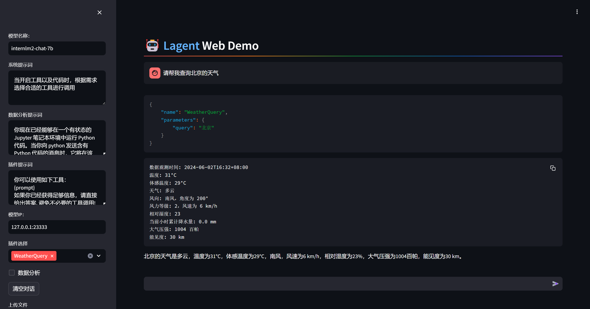

## 3 AgentLego：组装智能体“乐高”

### 3.1 直接使用 AgentLego

首先输入以下命令以下载`demo`文件：

```python
cd /root/agent
wget http://download.openmmlab.com/agentlego/road.jpg
```

其次输入以下命令以安装相关依赖：

```python
conda activate agent
pip install openmim==0.3.9
mim install mmdet==3.3.0
```

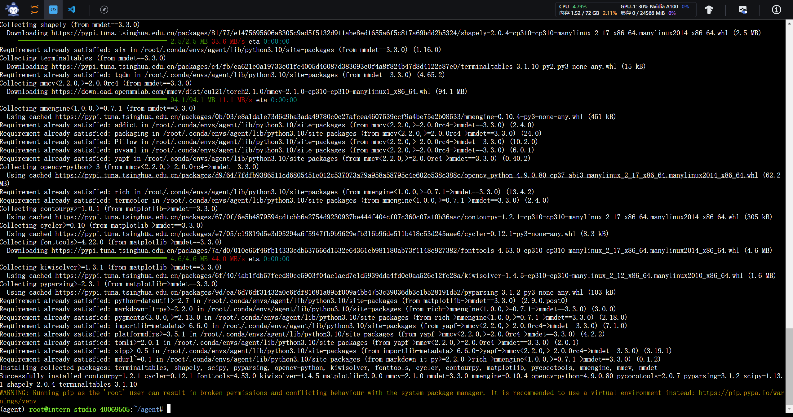

随后新建`/root/agent/direct_use.py`文件，并将下述内容复制进该文件中：

```python
import re

import cv2
from agentlego.apis import load_tool

# load tool
tool = load_tool('ObjectDetection', device='cuda')

# apply tool
visualization = tool('/root/agent/road.jpg')
print(visualization)

# visualize
image = cv2.imread('/root/agent/road.jpg')

preds = visualization.split('\n')
pattern = r'(\w+) \((\d+), (\d+), (\d+), (\d+)\), score (\d+)'

for pred in preds:
    name, x1, y1, x2, y2, score = re.match(pattern, pred).groups()
    x1, y1, x2, y2, score = int(x1), int(y1), int(x2), int(y2), int(score)
    cv2.rectangle(image, (x1, y1), (x2, y2), (0, 255, 0), 1)
    cv2.putText(image, f'{name} {score}', (x1, y1), cv2.FONT_HERSHEY_SIMPLEX, 0.8, (0, 255, 0), 1)

cv2.imwrite('/root/agent/road_detection_direct.jpg', image)
```

随后运行如下命令以进行智能体推理：

```python
python /root/agent/direct_use.py
```

等待模型权重下载并推理完成后，输出效果图如下所示：

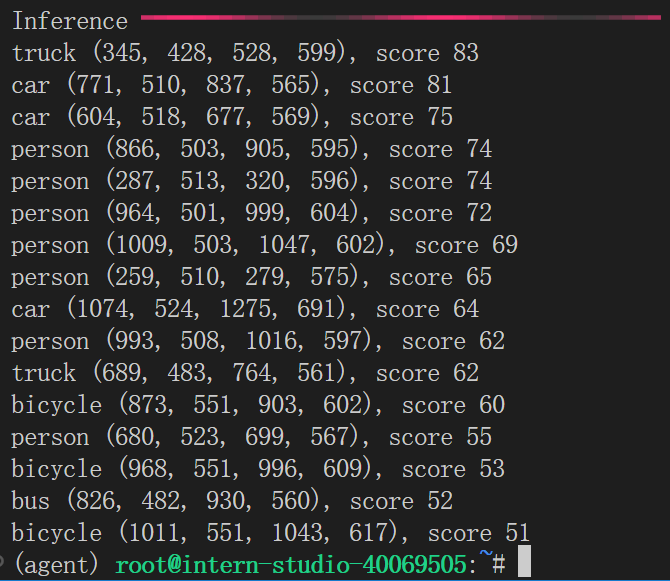


### 3.2 作为智能体工具使用

#### 3.2.1 修改相关文件

首先将`/root/agent/agentlego/webui/modules/agents/lagent_agent.py`文件的模型部分内容进行如下修改：

```python
def llm_internlm2_lmdeploy(cfg):
    url = cfg['url'].strip()
    llm = LMDeployClient(
-         model_name='internlm2-chat-20b',
+         model_name='internlm2-chat-7b',
        url=url,
        meta_template=INTERNLM2_META,
        top_p=0.8,
        top_k=100,
        temperature=cfg.get('temperature', 0.7),
        repetition_penalty=1.0,
        stop_words=['<|im_end|>'])
    return llm
```

#### 3.2.2 使用 LMDeploy 部署

输入以下命令以使用`LMDeploy`启动一个`api_server`：

```python
conda activate agent
lmdeploy serve api_server /root/share/new_models/Shanghai_AI_Laboratory/internlm2-chat-7b \
                            --server-name 127.0.0.1 \
                            --model-name internlm2-chat-7b \
                            --cache-max-entry-count 0.1
```

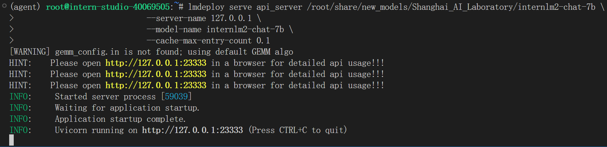

#### 3.2.3 启动 AgentLego WebUI

新建一个终端，并输入以下命令以启动`AgentLego WebUI`：

```python
conda activate agent
cd /root/agent/agentlego/webui
python one_click.py
```

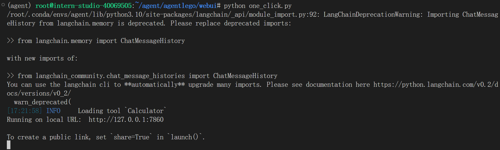

随后在本地打开一个`cmd`窗口，以进行`SSH`转发

#### 3.2.4 使用 AgentLego WebUI

接着在浏览器打开http://localhost:7860以使用`AgentLego WebUI`，配置好`Agent`，其效果图如下所示：

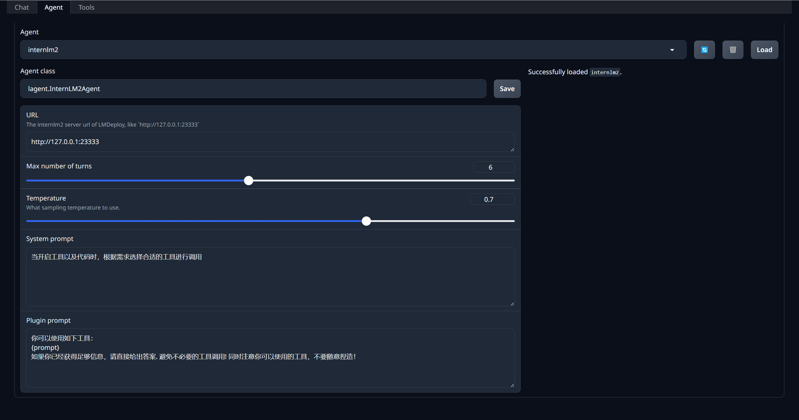

随后配置工具，其效果图如下所示：

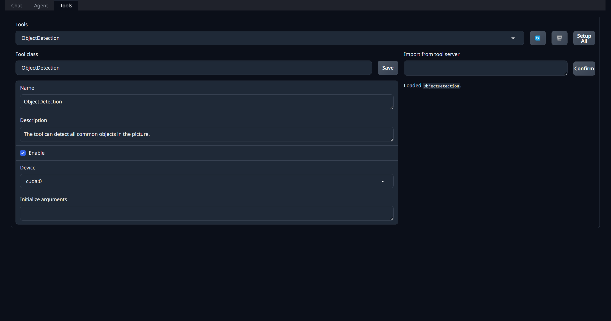

点击`Chat`以进入对话页面，上传准备好的`demo`图片，并键入内容示例如下，模型生成效果图如下所示：

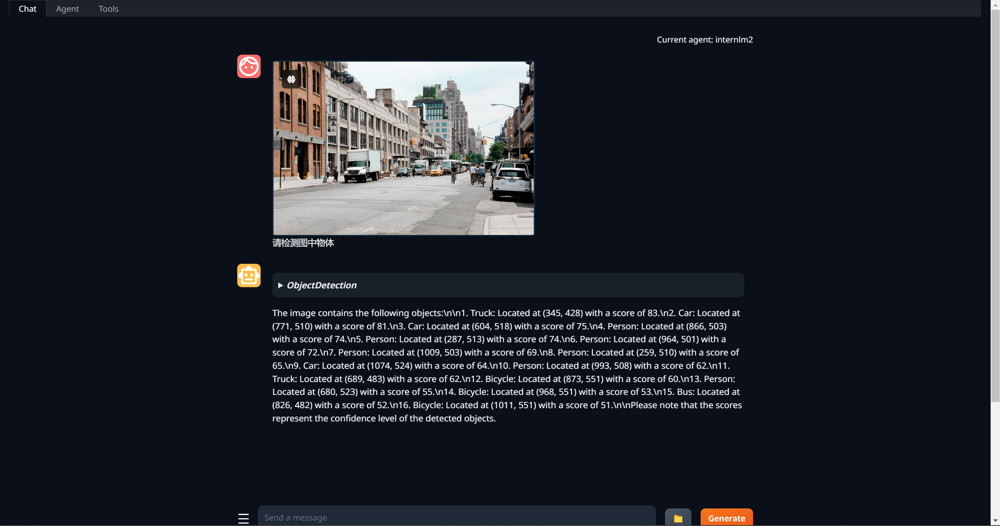

### 3.3 用 AgentLego 自定义工具

#### 3.3.1 创建工具文件

首先新建一个`/root/agent/agentlego/agentlego/tools/magicmaker_image_generation.py`文件，并将下述内容复制进该文件中：

```python
import json
import requests

import numpy as np

from agentlego.types import Annotated, ImageIO, Info
from agentlego.utils import require
from .base import BaseTool


class MagicMakerImageGeneration(BaseTool):

    default_desc = ('This tool can call the api of magicmaker to '
                    'generate an image according to the given keywords.')

    styles_option = [
        'dongman',  # 动漫
        'guofeng',  # 国风
        'xieshi',   # 写实
        'youhua',   # 油画
        'manghe',   # 盲盒
    ]
    aspect_ratio_options = [
        '16:9', '4:3', '3:2', '1:1',
        '2:3', '3:4', '9:16'
    ]

    @require('opencv-python')
    def __init__(self,
                 style='guofeng',
                 aspect_ratio='4:3'):
        super().__init__()
        if style in self.styles_option:
            self.style = style
        else:
            raise ValueError(f'The style must be one of {self.styles_option}')
        
        if aspect_ratio in self.aspect_ratio_options:
            self.aspect_ratio = aspect_ratio
        else:
            raise ValueError(f'The aspect ratio must be one of {aspect_ratio}')

    def apply(self,
              keywords: Annotated[str,
                                  Info('A series of Chinese keywords separated by comma.')]
        ) -> ImageIO:
        import cv2
        response = requests.post(
            url='https://magicmaker.openxlab.org.cn/gw/edit-anything/api/v1/bff/sd/generate',
            data=json.dumps({
                "official": True,
                "prompt": keywords,
                "style": self.style,
                "poseT": False,
                "aspectRatio": self.aspect_ratio
            }),
            headers={'content-type': 'application/json'}
        )
        image_url = response.json()['data']['imgUrl']
        image_response = requests.get(image_url)
        image = cv2.cvtColor(cv2.imdecode(np.frombuffer(image_response.content, np.uint8), cv2.IMREAD_COLOR),cv2.COLOR_BGR2RGB)
        return ImageIO(image)
```

#### 3.3.2 注册新工具

修改`/root/agent/agentlego/agentlego/tools/__init__.py`文件内容如下：

```python
from .base import BaseTool
from .calculator import Calculator
from .func import make_tool
from .image_canny import CannyTextToImage, ImageToCanny
from .image_depth import DepthTextToImage, ImageToDepth
from .image_editing import ImageExpansion, ImageStylization, ObjectRemove, ObjectReplace
from .image_pose import HumanBodyPose, HumanFaceLandmark, PoseToImage
from .image_scribble import ImageToScribble, ScribbleTextToImage
from .image_text import ImageDescription, TextToImage
from .imagebind import AudioImageToImage, AudioTextToImage, AudioToImage, ThermalToImage
from .object_detection import ObjectDetection, TextToBbox
from .ocr import OCR
from .scholar import *  # noqa: F401, F403
from .search import BingSearch, GoogleSearch
from .segmentation import SegmentAnything, SegmentObject, SemanticSegmentation
from .speech_text import SpeechToText, TextToSpeech
from .translation import Translation
from .vqa import VQA
+ from .magicmaker_image_generation import MagicMakerImageGeneration

__all__ = [
    'CannyTextToImage', 'ImageToCanny', 'DepthTextToImage', 'ImageToDepth',
    'ImageExpansion', 'ObjectRemove', 'ObjectReplace', 'HumanFaceLandmark',
    'HumanBodyPose', 'PoseToImage', 'ImageToScribble', 'ScribbleTextToImage',
    'ImageDescription', 'TextToImage', 'VQA', 'ObjectDetection', 'TextToBbox', 'OCR',
    'SegmentObject', 'SegmentAnything', 'SemanticSegmentation', 'ImageStylization',
    'AudioToImage', 'ThermalToImage', 'AudioImageToImage', 'AudioTextToImage',
    'SpeechToText', 'TextToSpeech', 'Translation', 'GoogleSearch', 'Calculator',
-     'BaseTool', 'make_tool', 'BingSearch'
+     'BaseTool', 'make_tool', 'BingSearch', 'MagicMakerImageGeneration'
]
```

#### 3.3.3 体验自定义工具效果

首先关闭之前开启的终端，随后输入以下命令以分别启动`LMDeploy`服务和`AgentLego`的`WebUI`：

```python
conda activate agent
lmdeploy serve api_server /root/share/new_models/Shanghai_AI_Laboratory/internlm2-chat-7b \
                            --server-name 127.0.0.1 \
                            --model-name internlm2-chat-7b \
                            --cache-max-entry-count 0.1
```

```python
conda activate agent
cd /root/agent/agentlego/webui
python one_click.py
```

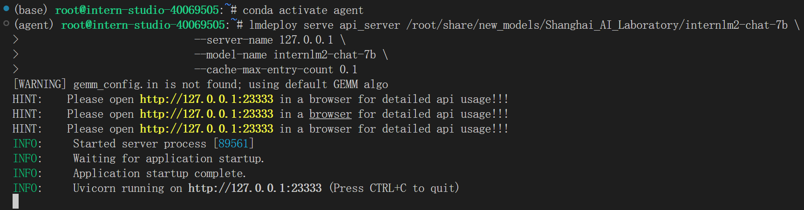

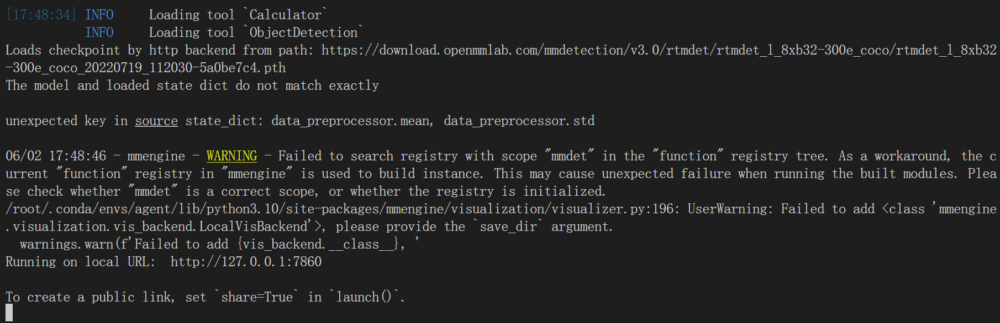

随后在本地打开一个`cmd`窗口，以进行`SSH`转发，接着在浏览器打开http://localhost:7860以使用`AgentLego WebUI`，配置好相同的`Agent`，随后配置工具，其效果图如下所示：

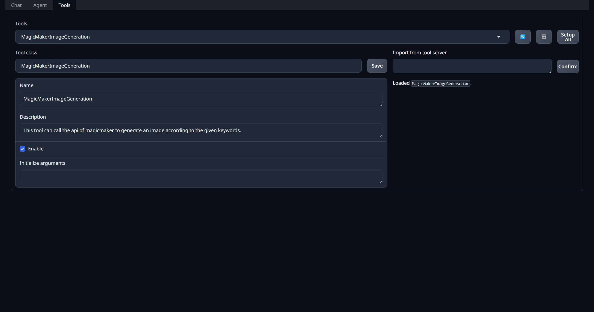

点击`Chat`以进入对话页面，并键入内容示例如下，模型生成效果图如下所示：

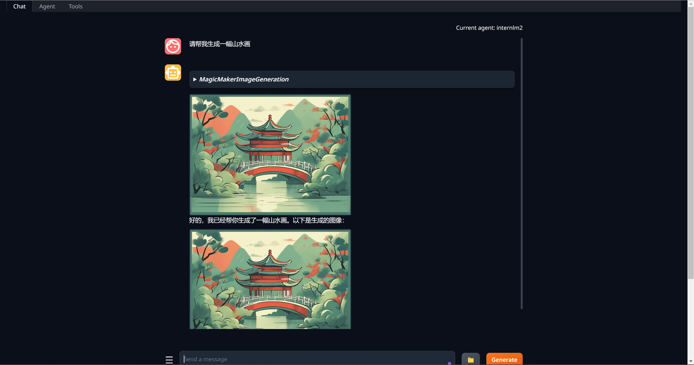