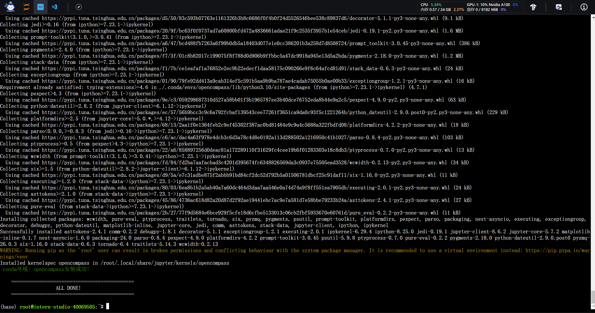
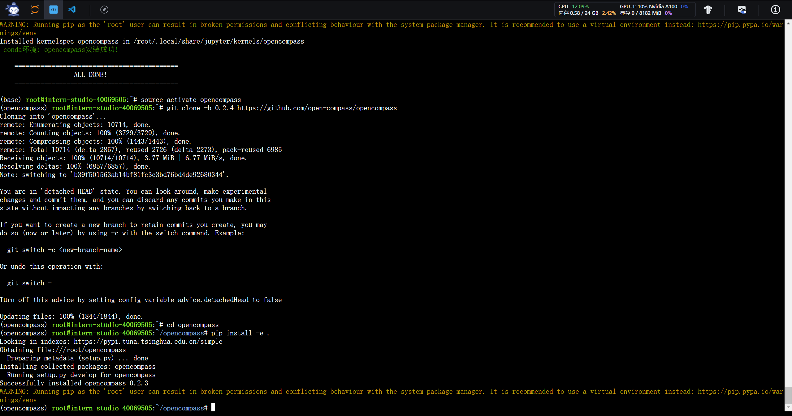
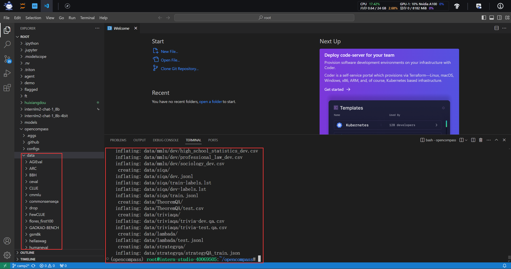
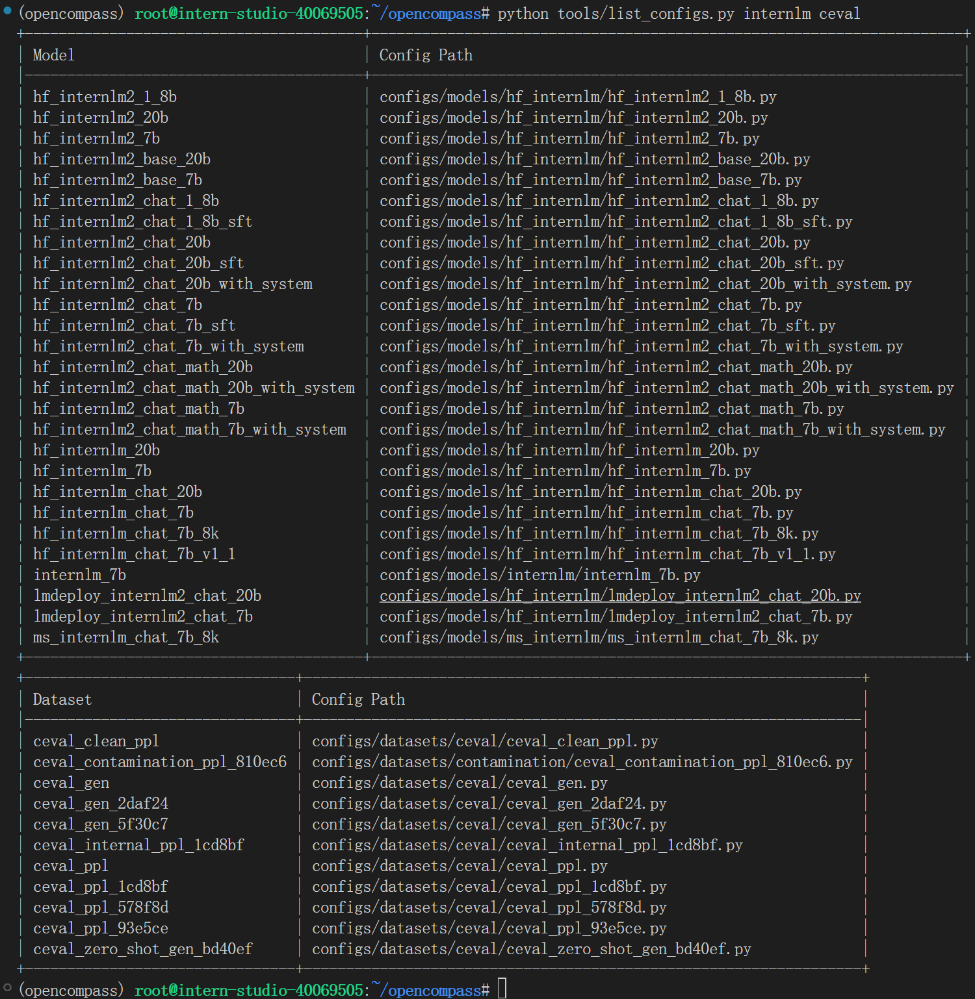
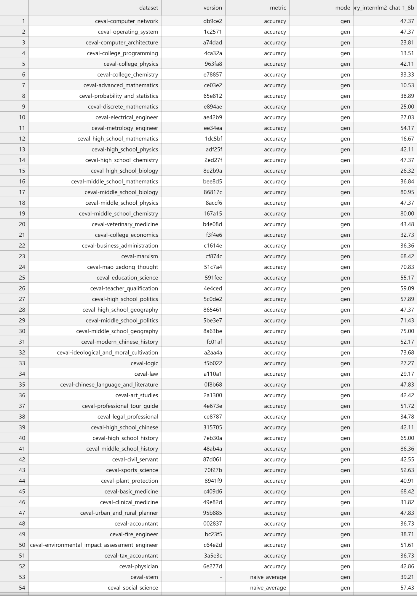

# 书生·浦语大模型实战营第二期（初夏专场）：（七）OpenCompass 大模型评测实战

## 1 环境配置

首先输入以下命令安装相应的虚拟环境：

```python
studio-conda -o internlm-base -t opencompass
```

安装成功后效果图如下所示：



随后输入以下命令以克隆`OpenCompass`代码库到服务器并安装好相关依赖：

```python
source activate opencompass
git clone -b 0.2.4 https://github.com/open-compass/opencompass
cd opencompass
pip install -e .
```

安装成功后效果图如下所示：



## 2 数据准备

输入以下命令以解压评测数据集到`data/`目录处：

```python
cp /share/temp/datasets/OpenCompassData-core-20231110.zip /root/opencompass/
unzip OpenCompassData-core-20231110.zip
```

解压后效果图如下所示：



## 3 查看支持的数据集和模型

输入以下命令以查看所有与`InternLM `及`C-Eval`相关的配置：

```python
python tools/list_configs.py internlm ceval
```

运行后得到效果图如下所示：



## 4 启动评测

首先安装好相关依赖后，输入以下命令以解决评测过程中可能发生的错误：

```python
pip install protobuf
export MKL_SERVICE_FORCE_INTEL=1
export MKL_THREADING_LAYER=GNU
```

随后输入以下命令启动评测：

```python
python run.py --datasets ceval_gen --hf-path /share/new_models/Shanghai_AI_Laboratory/internlm2-chat-1_8b --tokenizer-path /share/new_models/Shanghai_AI_Laboratory/internlm2-chat-1_8b --tokenizer-kwargs padding_side='left' truncation='left' trust_remote_code=True --model-kwargs trust_remote_code=True device_map='auto' --max-seq-len 1024 --max-out-len 16 --batch-size 2 --num-gpus 1
```

评测结束后，生成结果如下所示：

